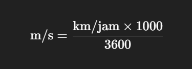
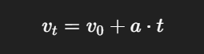
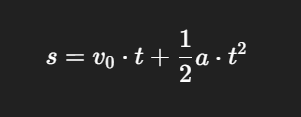

## 🧠 Soal Python Sesi 2 - Tuple, Set, Dict, Input, Operator

### 🔹 **Soal 1: Tuple**

Sebuah fungsi mengembalikan data tuple berisi nama siswa dan nilainya:

```python
("Rani", 85, 90, 78)
```

Tugas kamu:

1. Simpan data tersebut ke dalam tuple.
2. Hitung rata-rata nilai.
3. Cetak output dalam format:

```
Rani mendapatkan rata-rata nilai: 84.33
```

---

### 🔹 **Soal 2: Set - Gabungan dan Irisan (hint:gunakan opeartor logika)**

Diberikan dua set:

```python
hobi_siswa_A = set(['membaca', 'berenang', 'menulis'])
hobi_siswa_B = set(['menulis', 'berkebun', 'bersepeda'])
```

1. Tampilkan hobi yang **dimiliki kedua siswa**. 
2. Tampilkan semua hobi yang **dimiliki setidaknya oleh salah satu siswa**.
3. Tampilkan hobi yang **hanya dimiliki oleh siswa A**.

---

### 🔹 **Soal 3: Dictionary - Data Siswa**

Diberikan dictionary berikut:

```python
siswa = {
    'nama': 'Bagas',
    'nilai': [80, 90, 85],
    'kelas': '8B'
}
```

1. Tambahkan key baru `"umur"` dengan nilai `14`.
2. Hitung dan tambahkan nilai `"rata_rata"` berdasarkan isi list `nilai`.
3. Cetak dictionary `siswa` dengan format rapi seperti:

```
Nama    : Bagas
Kelas   : 8B
Umur    : 14
Nilai   : [80, 90, 85]
Rata2   : 85.0
```

### 🔹 **Soal 4: Input & String Manipulation**

Buat program yang:

1. Meminta user memasukkan **nama lengkap** (menggunakan `input()`).
2. Program akan menampilkan:

   * Panjang karakter dari nama yang dimasukkan.
   * Huruf pertama dan huruf terakhir dari nama.
   * Nama dalam huruf **kapital semua**.
   * Nama dalam huruf **kecil semua**.
   * Jumlah huruf vokal dalam nama (a, i, u, e, o — tidak case sensitive)

🧠 *Contoh Output:*

```
Masukkan nama lengkap: Aisyah Rahma
Panjang nama        : 12
Huruf pertama       : A
Huruf terakhir      : a
Nama huruf besar    : AISYAH RAHMA
Nama huruf kecil    : aisyah rahma
Jumlah huruf vokal  : 5
```
---

### 🔹 **Soal 5: Operator Kombinasi**

Diberikan variabel berikut:

```python
a = 15
b = 4
```

Hitung dan tampilkan hasil dari:

1. `a + b * 2`
2. `(a + b) * 2`
3. `a ** b`
4. `a // b`
5. `a % b`

**Tantangan Tambahan**:
Buat program yang menerima `a` dan `b` dari input user, lalu menghitung semua hasil di atas secara otomatis.


## 🔹 **Soal 6: Kata Unik dari Kalimat (Set & String)**

Buat program yang:

1. Meminta user memasukkan sebuah **kalimat bebas**.
2. Program harus:

   * Memecah kalimat menjadi **kata-kata**.
   * Menyimpan kata-kata tersebut dalam sebuah **set** agar tidak ada duplikat.
   * Menampilkan:

     * Jumlah kata total
     * Jumlah kata unik
     * Semua kata unik dalam urutan **alfabet**

> Gunakan: `.split()`, `set()`, dan `sorted()`

---

### 🧠 Contoh Output:

```
Masukkan kalimat: saya suka python dan saya suka belajar
Jumlah kata total : 7
Jumlah kata unik  : 5
Kata unik         : ['belajar', 'dan', 'python', 'saya', 'suka']
```

---

## 🔹 **Soal 7: Modul `math` – Pembulatan & Akar Kuadrat**

Buat program yang:

1. Meminta user memasukkan sebuah **bilangan desimal** (float).
2. Tampilkan:

   * Nilai pembulatan ke bawah (`math.floor()`)
   * Nilai pembulatan ke atas (`math.ceil()`)
   * Akar kuadrat dari bilangan tersebut (`math.sqrt()`)

> Gunakan: `import math` dan fungsi-fungsinya.

---

### 🧠 Contoh Output:

```
Masukkan bilangan desimal: 6.4
Pembulatan ke bawah : 6
Pembulatan ke atas  : 7
Akar kuadrat        : 2.53
```

---

## 🔹 **Soal 8: GLBB – Bus Dipercepat**

> 🚌 Sebuah **bus** sedang melaju di jalan dengan kecepatan **40 km/jam**. Lalu bus dipercepat dengan percepatan **2 m/s²** selama **30 detik**.

### 🎯 Tugas:

1. Hitung kecepatan akhir bus dalam **m/s**.
2. Hitung jarak yang ditempuh selama percepatan.

> Gunakan rumus:

* Konversi kecepatan awal:

  

* Kecepatan akhir:

  

* Jarak:

  

---

### 🧠 Contoh Output:

```
Masukkan kecepatan awal (km/jam): 40
Masukkan percepatan (m/s²): 2
Masukkan waktu (detik): 30

-------------------------------
       HASIL PERHITUNGAN
-------------------------------
Kecepatan awal      : 11.11 m/s
Percepatan          : 2 m/s²
Waktu               : 30 detik

Kecepatan akhir     : 71.11 m/s
Jarak yang ditempuh : 1233.30 meter
```

---
